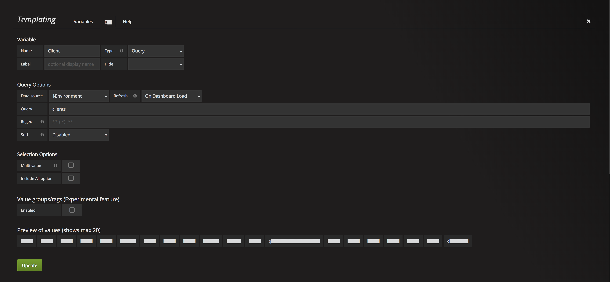
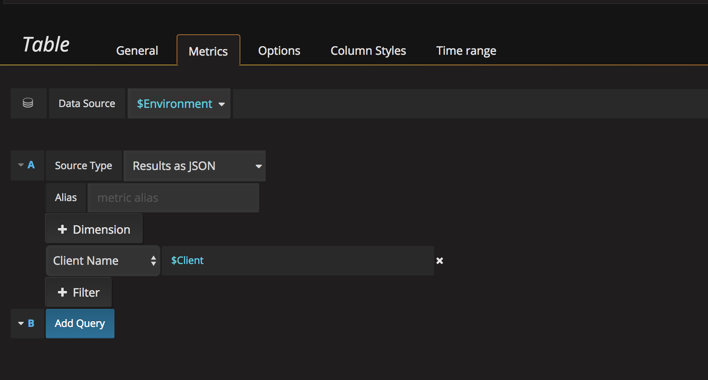

# Sensu Datasource Plugin for Grafana

[Sensu](https://sensuapp.org) is a monitoring system typically front-ended by Uchiwa.

Screenshot of plugin with datatable panel:

Results can be return as a table or as JSON, this is the "table" data:

This is the JSON data:

This is the same JSON data but will column selection:

Additional docs at [github.io](https://briangann.github.io/grafana-sensu-datasource)

### About this plugin
This is a datasource plugin for integrating [Grafana 3.x/4.x](https://grafana.org) and Sensu. It provides a query builder to return data about Events, Results, Aggregates, and Clients.

The query builder provides hints for each type, with two optional dimensions "Client Name" and "Check Name".

### Running with Docker
A ``docker-compose.yml`` file is provided to easily stand up a Grafana 3.x server with this datasource mapped to the container.

### Installation

* Copy/clone this repos into /var/lib/grafana/plugins
* Restarting ``grafana-server`` is required to pick up the plugin.

Once the plugin is "feature complete" a PR will be made to add this plugin to the official datasource plugins on [Grafana.net](http://grafana.net)

### Using the plugin

#### Setup datasource

And and test datasource by setting the Url to the Sensu API, typically on port 4567.

#### Using the query builder

Add a new "Table" to a dashboard and select the Sensu datasource. Choosing results, you will get a "dimensions" option to narrow the dataset.

There are 11 options for the datasource:

1. Aggregates: Returns aggregate check states, with 7 different "modes"
  1. List
  2. Clients
  3. Checks
  4. Results Critical
  5. Results OK
  6. Results Unknown
  7. Results Warning
2. Check Subscriptions: Returns list of checks associated with a subscription
  Dimensions
  * name - name of check
  * aggregate - name of aggregate
  * type (metric|check)
  * source - JIT client
3. Clients
4. Client History: Similar to Results, but with additional data
   * NOTE: this is a deprecated API but still actively used by Uchiwa
5. Events: Returns active events (alerts)
6. Events as JSON: Returns active events (alerts)
7. Results as JSON: Returns check results in JSON format
8. Results as Table: Returns check results in Table format
9. Sensu Health
10. Silenced Entries
11. Stashes

#### Dimensions

Choosing results, you will get a "dimensions" option to narrow the dataset.

Select the textbox for metrics, and hints will be provided:

#### Templating

Support exists for using the following as template variables in Grafana:

1. Clients
2. Checks
3. Aggregates

Here is an example configuration adding `Client` as a template variable:

Once added, you can reference the template variable as you would with any other Grafana datasource. Here is an example showing how to limit a table panel to show just the selected client:

### Tunneling

ssh -i ~/.ssh/environment.pem -L 4567:localhost:4567 ec2-user@ec2-52-1-1-1.us-west-2.compute.amazonaws.com

### References

More info about Sensu [here](https://sensuapp.org).

### TODO

source type: client history
  needs dimension: check_name filter
  and min/max/current/avg/total selector
source type: aggregates, aggregate mode: list
  need dimension to pick aggregate field “checks/clients/crit/ok/stale/etc”
  and min/max/current/avg/total selector
